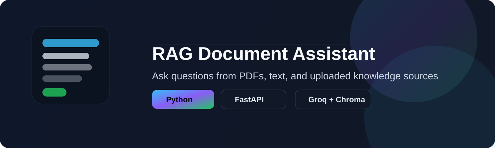
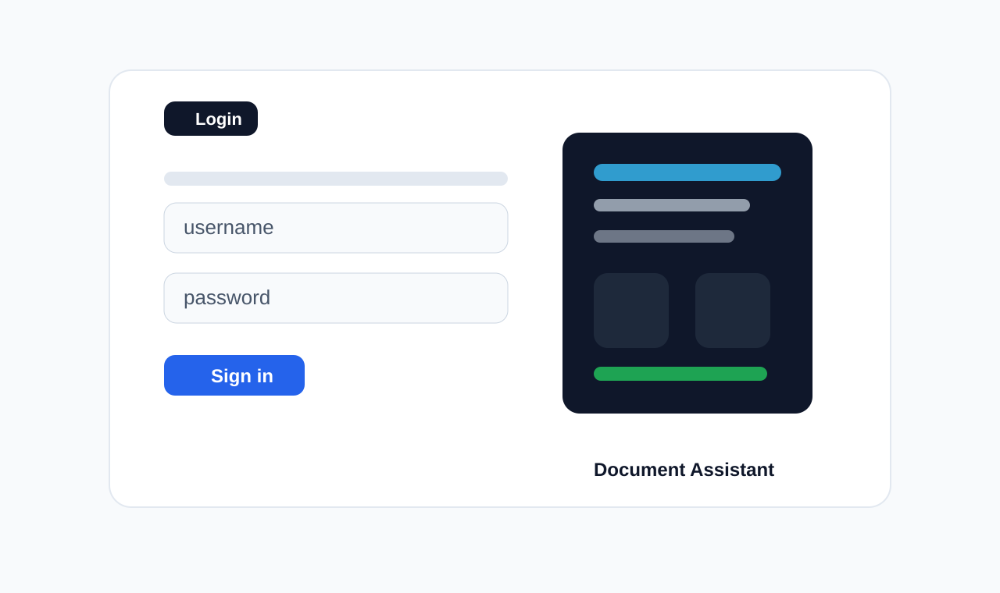
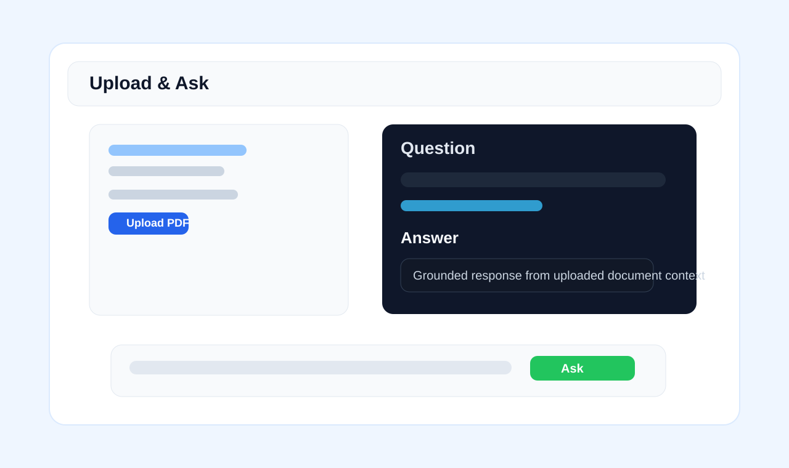

# Retrieval-Augmented Generation (RAG) Assistant

<div align="center">
  
</div>

<p align="center">
  <a href="https://www.python.org/">
    
  </a>
  <a href="https://fastapi.tiangolo.com/">
    
  </a>
  <a href="https://groq.com/">
    
  </a>
  <a href="https://www.trychroma.com/">
    
  </a>
</p>

A production-style local document Q&A system that lets you upload PDFs, text files, and images, then ask natural-language questions and get grounded answers from your own content.

## Why this project

This app is designed for fast local RAG workflows using:

- PDF, DOCX, TXT, and image ingestion
- local vector search with ChromaDB
- Groq-based answer generation grounded in retrieved context
- a simple browser UI for non-technical users
- graph-style extraction for richer document understanding

## Core features

- Smart document ingestion for PDF, DOCX, TXT, and image files
- Context-aware question answering from uploaded documents
- Fast local semantic retrieval using embeddings
- Clean web interface with login, upload, and chat flow
- Optional graph-based relationship extraction for document insight
- Lightweight deployment for demos, labs, and internal tools

## Screenshots

### Login screen



### RAG chat interface



## Quick start

### 1. Create a virtual environment

```bash
python -m venv .venv
.venv\Scripts\activate
```

### 2. Install dependencies

```bash
pip install -r requirements.txt
```

### 3. Configure environment variables

```bash
copy .env.example .env
```

Then update the file with values such as:

- GROQ_API_KEY
- APP_USERS
- SECRET_KEY

### 4. Run the app

```bash
cd groq_assistant
python app.py
```

Then open:

```text
http://127.0.0.1:8000/
```

## Default credentials

Example local login values:

- admin / admin123
- staff / staff123

## Project structure

```text
RAG/
├── groq_assistant/        # main web app and frontend
├── rag_system/            # reusable backend RAG services
├── .env.example           # environment template
├── requirements.txt       # Python dependencies
├── README.md              # project landing page
├── SETUP_GUIDE.md         # setup instructions
├── QUICK_REFERENCE.md     # quick usage notes
└── run.bat                # Windows launcher
```

## Notes

- This project is tuned for local deployment and experimentation.
- For production use, add proper security controls, HTTPS, and secret management.
- The app can be extended with user-level permissions, database storage, and stronger monitoring.

## License

This repository is intended primarily for educational, prototyping, and demo use.

## Contact

Use the GitHub issues page for questions, feature requests, or deployment support.

